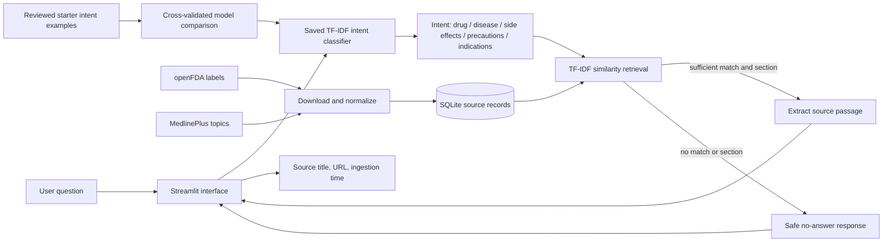
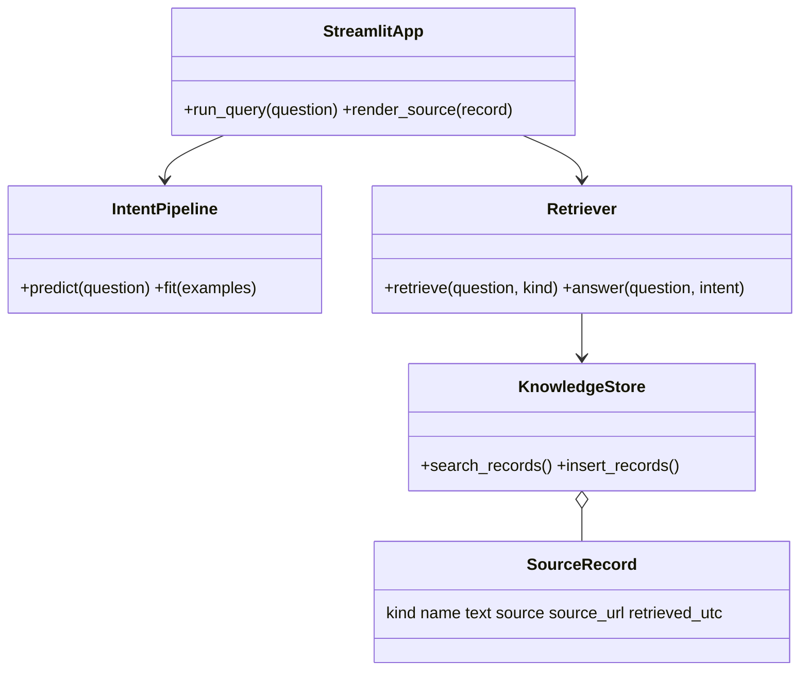

# System architecture

```mermaid
flowchart LR
  U[User question] --> UI[Streamlit interface]
  UI --> C[Saved TF-IDF intent classifier]
  C --> I[Intent: drug / disease / side effects / precautions / indications]
  I --> R[TF-IDF similarity retrieval]
  K[(SQLite source records)] --> R
  R -->|sufficient match and section| A[Extract source passage]
  R -->|no match or section| F[Safe no-answer response]
  A --> UI
  F --> UI
  UI --> S[Source title, URL, ingestion time]
  FDA[openFDA labels] --> D[Download and normalize]
  MP[MedlinePlus topics] --> D
  D --> K
  Q[Reviewed starter intent examples] --> T[Cross-validated model comparison]
  T --> C
```

## UML component view

```mermaid
classDiagram
  class StreamlitApp {+run_query(question) +render_source(record)}
  class IntentPipeline {+predict(question) +fit(examples)}
  class Retriever {+retrieve(question, kind) +answer(question, intent)}
  class KnowledgeStore {+search_records() +insert_records()}
  class SourceRecord {kind name text source source_url retrieved_utc}
  StreamlitApp --> IntentPipeline
  StreamlitApp --> Retriever
  Retriever --> KnowledgeStore
  KnowledgeStore o-- SourceRecord
```
