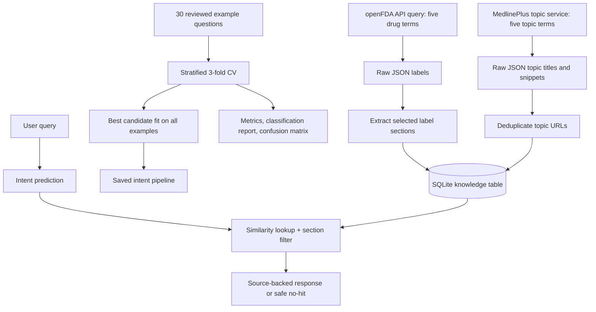

# Data flow

```mermaid
flowchart TD
  A[openFDA API query: five drug terms] --> B[Raw JSON labels]
  C[MedlinePlus topic service: five topic terms] --> D[Raw JSON topic titles and snippets]
  B --> E[Extract selected label sections]
  D --> F[Deduplicate topic URLs]
  E --> G[(SQLite knowledge table)]
  F --> G
  H[30 reviewed example questions] --> I[Stratified 3-fold CV]
  I --> J[Metrics, classification report, confusion matrix]
  I --> K[Best candidate fit on all examples]
  K --> L[Saved intent pipeline]
  M[User query] --> N[Intent prediction]
  N --> O[Similarity lookup + section filter]
  G --> O
  O --> P[Source-backed response or safe no-hit]
```

Generated visual evaluation figures are saved under `reports/figures/` after running `python src/train_model.py`.
